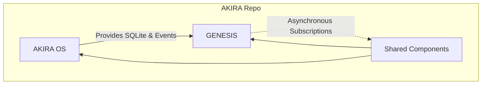

# AKIRA Ownership Architecture

This document defines the ownership boundaries and responsibilities for the two-developer workflow of Project AKIRA.

---

## Subsystem Allocation & Roles

AKIRA is built on **One Repository**, **One Application**, and **One Release Cycle**, split logically into two pillars.



### 1. AKIRA OS (Reality Layer)
* **Owner**: **Platform Lead** (Developer B)
* **Question Answered**: *"What exists in the user's world?"*
* **Core Purpose**: Manages the physical workspace (projects, tasks, notes, sessions, file metadata, search index, local settings) and runs the local persistence layer.
* **Responsibilities**:
  * **Timeline & Sessions**: Tracking user activity and history.
  * **Search & Indexing**: Local search orchestration and provider definitions.
  * **File Vault**: File storage management and metadata.
  * **Analytics**: Metrics calculation and productivity analysis.
  * **Database & Persistence**: SQLite schemas, migrations, seed scripts, and repository implementations.
  * **UI**: Core application layout, shell views, routing folders, and styling framework.
* **Owned Directories**:
  * `/src/akira-os/` (OS Core Services)
  * `/src/persistence/` (SQLite Database & Stores)
  * `/src/routes/` (App Routes & View Controllers)
  * `/src/app/` (Base UI components & Router Setup)

### 2. GENESIS (Interpretation Layer)
* **Owner**: **Founder / CTO** (Developer A)
* **Question Answered**: *"What does it all mean?"*
* **Core Purpose**: Coordinates the cognitive and context-resolution engines (memories, stories, understanding, insights, relationships, active focus, prompt preparation).
* **Responsibilities**:
  * **Events**: Domain event processing and graph building.
  * **Memory**: Short-term and long-term consolidation and importance decay.
  * **Stories**: Constructing narrative arcs out of raw events.
  * **Understanding**: Emergent profile building, hypothesis testing, and user identity layer.
  * **Insights**: Pattern discovery, reflection triggers, and intelligence engines.
  * **Planning & Initiative**: Evaluation of active goals, habits, and proactive decision triggers.
  * **AI Context**: LLM provider integrations, prompt structures, and API calls.
* **Owned Directories**:
  * `/src/genesis/` (Genesis Core Services)
  * `/docs/GENESIS/` (Genesis Technical Specifications)

### 3. Shared Components
* **Owner**: **Joint Ownership** (Developer A & Developer B)
* **Core Purpose**: Shared building blocks, contracts, and platform infrastructure.
* **Responsibilities**:
  * **Contracts**: Event schemas, repository interfaces, and search definitions.
  * **Shared Utilities**: Common error reporting, logging, and styling tokens.
  * **Infrastructure**: The global Event Bus (`eventBus`) and helper libraries.
* **Owned Directories**:
  * `/src/contracts/` (Subsystem Interfaces)
  * `/src/shared/` (Infrastructure, Event Bus, and Utilities)
  * `/src/lib/` (Base Platform Helpers)

---

## Architectural Rules & Dependency Rules

To keep the codebase modular, testable, and separate, developers must enforce the following dependency boundaries:

```text
       ┌───────────┐
       │ AKIRA OS  │
       └─────┬─────┘
             │ (Imports contract interfaces)
             ▼
       ┌───────────┐
       │ Contracts │
       └─────▲─────┘
             │ (Imports contracts & subscribes to events)
             ▼
       ┌───────────┐
       │  GENESIS  │
       └───────────┘
```

1. **Dependency Direction**:
   * **Allowed**: `AKIRA OS` $\rightarrow$ `Contracts` $\rightarrow$ `GENESIS` (via Event Bus subscriptions and Repository interfaces).
   * **Forbidden**: 
     * `GENESIS` importing internal implementation files of `AKIRA OS` (except for Presence models & base client instance required for context tracking).
     * `AKIRA OS` importing internal implementation files of `GENESIS`.
     * **Circular Dependencies**: No component may import another recursively.
2. **Subsystems expose only Public APIs**:
   * Inter-directory imports must ONLY reference barrel index files (e.g. `/src/akira-os/index.ts` and `/src/genesis/index.ts`). Deep internal pathing (e.g., `import ... from "../genesis/context/goals/service"`) is forbidden.
3. **No direct DB/SQL outside Repositories**:
   * All database read/write actions must go through repository classes matching the interfaces defined in `/src/contracts/repositories/`.
