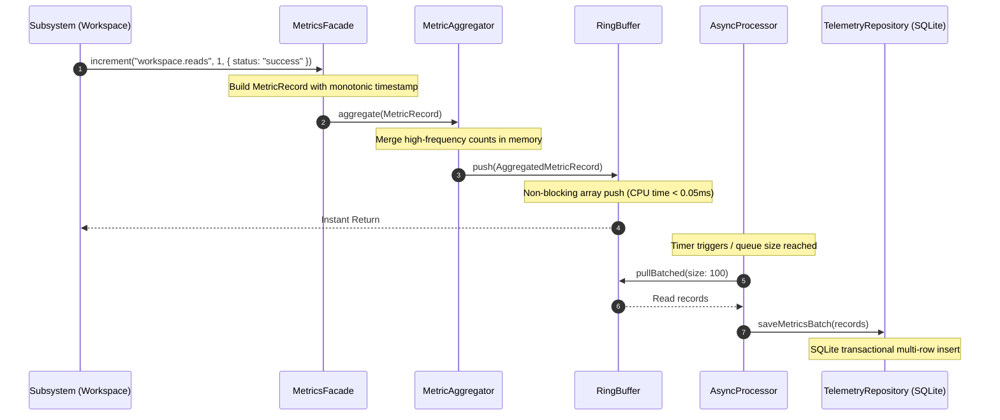
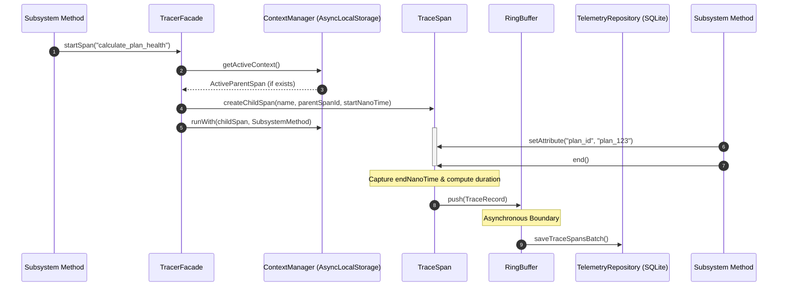
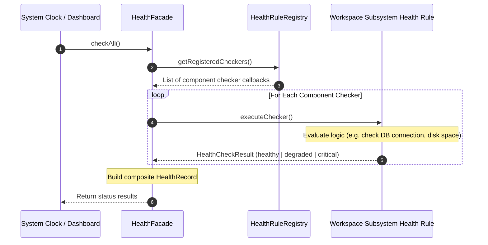
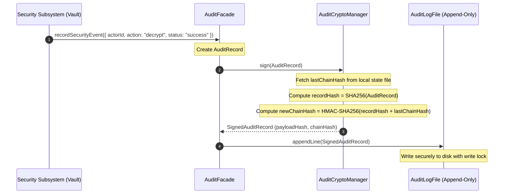

# AKIRA OS Observability Data Flow Specification

This document maps the runtime data flow and execution sequence diagrams for ingestion, aggregation, storage, queries, and exports of telemetry.

---

## 1. Metric Recording Flow
High-speed metric increments and value logging are completely decoupled from blocking operations.



---

## 2. Trace Recording Flow
Execution trace spans use `AsyncLocalStorage` to associate child spans automatically with their correct parents.



---

## 3. Log Recording Flow
Structured logs automatically inherit trace context from the active execution span.

```text
[Subsystem Call] ──> TelemetryService.logger.info("Task created", { taskId })
                           │
                           ▼
                 [ContextManager] ──(Retrieves active Trace ID and Span ID)
                           │
                           ▼
                  [Build LogRecord]
                           │
                           ▼
                     [RingBuffer]  <─── Asynchronous offloading
                           │
                           ▼
               [Background Log Processor]
                ┌──────────┴──────────┐
                ▼                     ▼
      [SQLite Repository]     [ConsoleReporter] (Format: JSON/Text)
```

---

## 4. Health Check Flow
Health check rules are executed on-demand or on a scheduler. They are deterministic and pure.



---

## 5. Audit Event Flow
Audit records require cryptographic protection to verify data integrity and prevent tampering.



---

## 6. Dashboard Query Flow
Querying telemetry for display isolates reads from high-speed write targets.

```text
[Dashboard UI] ──> ObservabilityQueryFacade.getTraceSummary("trace_123")
                          │
                          ▼
             [SQLite Read Connection] (Optimized with Read-Ahead WAL)
                          │
                          ▼
            [Query Index on trace_id] (Timestamp-sorted)
                          │
                          ▼
             [Return Trace Details Graph]
```

---

## 7. Storage & Exporter Flow
The storage layer handles direct persistence and dispatches batches to external exporters.

```text
                  [Async Batch Processor]
                             │
            ┌────────────────┴────────────────┐
            ▼                                 ▼
   [TelemetryRepository]             [TelemetryExporter]
  (Writes batches of metrics,        (Forwards telemetry records to
   traces, and logs to SQLite)        OpenTelemetry or Console endpoints)
```

---

## 8. Runtime Instrumentation Flow
How business components leverage the API:

```typescript
import { telemetry } from "src/observability";

class WorkspaceService {
  async loadWorkspace(workspaceId: string) {
    // 1. Automatic Tracing Wrapper
    return telemetry.tracer.trace("workspace.load", async (span) => {
      span.setAttribute("workspace_id", workspaceId);
      
      try {
        // 2. Log Ingestion
        telemetry.logger.info("Attempting to load database file", { workspaceId });
        
        const db = await this.openDb(workspaceId);
        
        // 3. Metric Recording
        telemetry.metrics.increment("workspace.load.success");
        return db;
      } catch (err) {
        // 4. Error Logging and Exception Capture
        span.recordException(err);
        telemetry.logger.error("Failed to load workspace database", err, { workspaceId });
        telemetry.metrics.increment("workspace.load.failure");
        throw err;
      }
    });
  }
}
```
