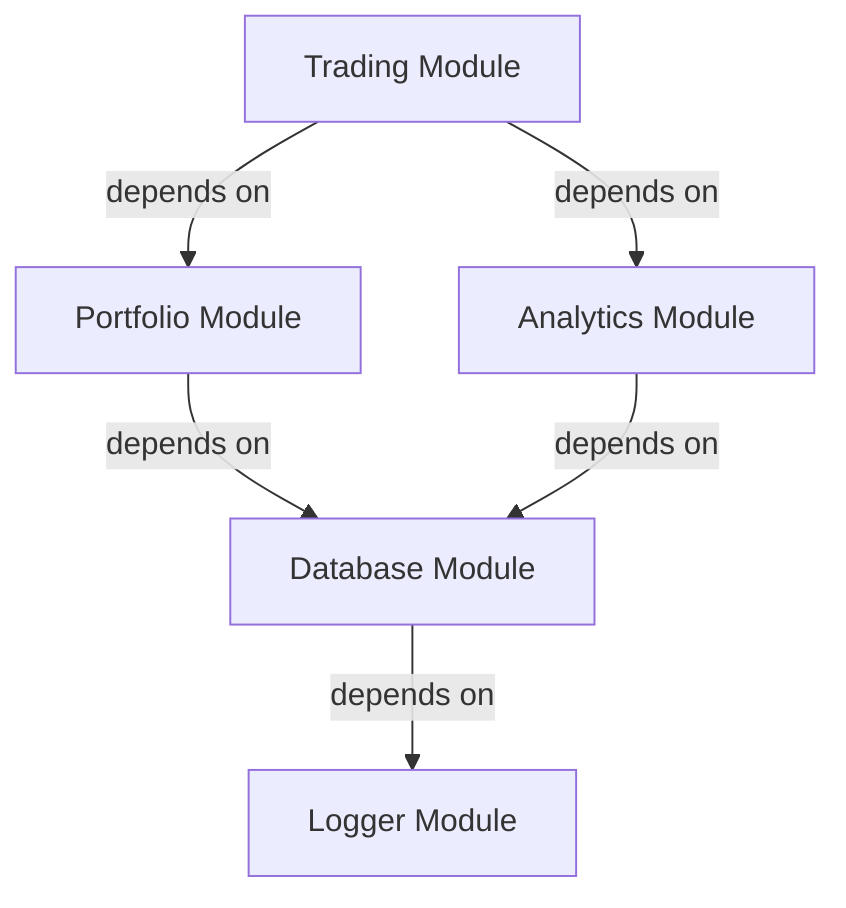

# Dependency Resolver

This document outlines the dependency resolution model, topological sorting algorithms, circular loop diagnostics, and execution planning for **AKIRA OS**.

---

## Dependency Model

AKIRA OS is a modular system where independent modules declare their relationships and dependencies declaratively in their manifests. The runtime resolver constructs a directed acyclic graph (DAG) representing these relations to determine a safe, deterministic loading order.

---

## Graph Architecture

The graph represents each module as a `DependencyNode` where:
* **Nodes ($V$)**: Module runtime instances.
* **Edges ($E$)**: Directed dependencies ($A \rightarrow B$ means A depends on B, so B must boot before A).

### Properties of a `DependencyNode`
* `moduleId`: Unique module identifier string.
* `dependencies`: Set of module IDs this node requires.
* `dependents`: Set of module IDs that require this node (constructed backward links).
* `visited` / `temporaryMark` / `permanentMark`: Traversal flag markers.

---

## Resolution Algorithm

### Startup Sequence (Topological Sorting)

Topological sorting arranges nodes linearly such that for every directed edge $u \rightarrow v$, node $v$ comes before $u$.

We implement topological sorting using a deterministic **Depth-First Search (DFS)** algorithm:
1. Sort all root module IDs alphabetically to eliminate file-system iteration discrepancies.
2. For each module, recursively visit its dependencies.
3. Once all dependencies of a module are visited, add the module to the execution order array.
4. The resulting sequence places low-level base libraries first and high-level client tools last.

---

## Shutdown Sequence

The module shutdown sequence must execute in **reverse startup order**. This ensures that dependent modules are shut down and release their resources gracefully before the underlying services they depend on are stopped.

$$\text{Shutdown Order} = \text{Reverse}(\text{Startup Order})$$

---

## Cycle Detection

If module relations form a circle (e.g. $A \rightarrow B \rightarrow C \rightarrow A$), topological sorting is mathematically impossible. 

We detect cycles during DFS traversal using **Temporary and Permanent Marks**:
* **Temporary Mark**: Set when a node is added to the current recursion stack path.
* **Permanent Mark**: Set when a node and all of its dependencies have been fully processed.

If a DFS recursion encounters a node already flagged with a `temporaryMark`, a circular loop is identified. The resolver extracts the exact path of the cycle from the recursion stack (e.g. `Trading -> Portfolio -> Analytics -> Trading`) to provide diagnostic trace information, rather than a generic error.

---

## Fault Tolerance (Transitive Skipping)

To keep the platform operational despite invalid dependency structures:
1. The resolver isolates circular references and missing dependencies.
2. It executes a transitive closure traversal: any module that requires a skipped or failed module is automatically skipped.
3. The resolver returns a safe execution plan containing only the subset of modules that are completely loadable, permitting the platform to boot successfully.

---

## Best Practices

1. **Keep Graphs Simple**: Avoid redundant dependency loops (e.g. A depending on B, and B depending on C, and A depending on C directly).
2. **Explicit Declarations**: Ensure all requested imports are documented inside `manifest.yaml` dependencies.
3. **Alphabetical Determinism**: Never rely on loading order; write your code assuming the resolver boots dependencies in alphabetical topological order.
