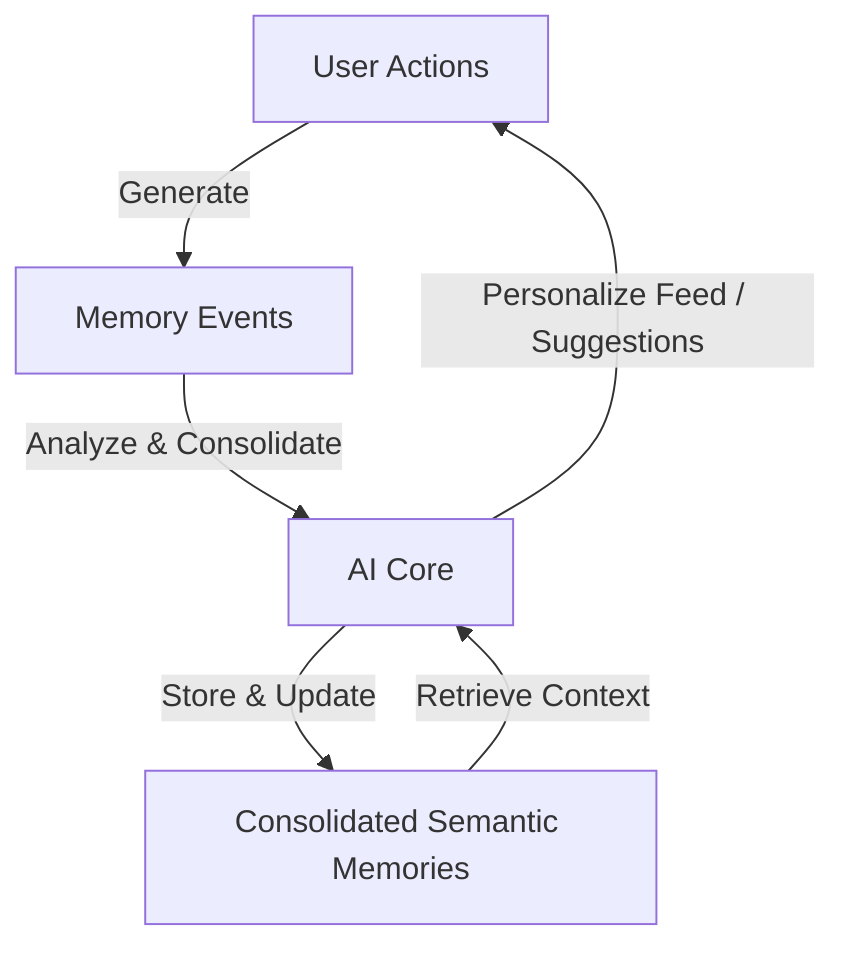
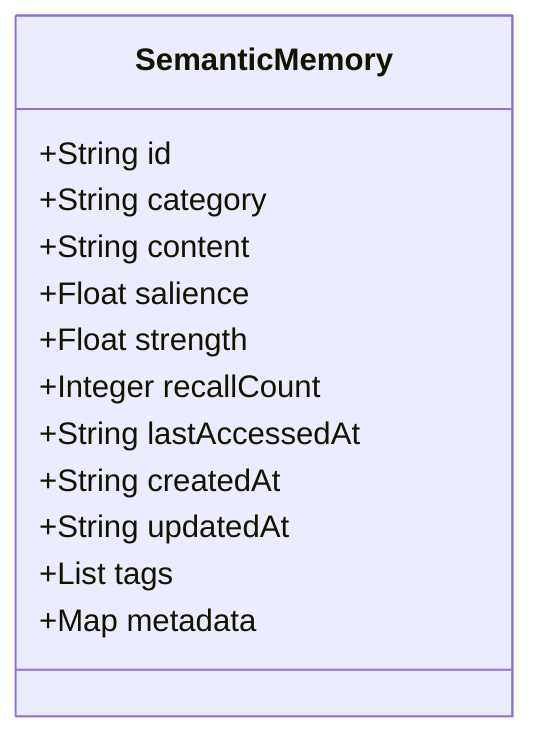

# Conceptual Memory Schema

This document defines the conceptual schema for the **Adaptive Memory Engine** within the **AKIRA** companion. It describes how memories are structured, categorized, and recalled over time to provide a personalized, contextual, and growth-oriented user experience.

---

## 1. System Overview

The Adaptive Memory Engine is designed to bridge the gap between raw, historical interaction logs and long-term, high-level user patterns, preferences, and facts. To support a desktop-first, privacy-respecting, and offline-ready design, the schema is divided into two distinct conceptual entities:

1. **Memory Events (Ephemeral / Logged Interactions)**: Direct logs of actions taken by the user or the system (e.g., completing a project, editing a note).
2. **Consolidated Semantic Memories (Refinements / Facts)**: High-level insights, user preferences, and synthesized facts extracted by the AI core (e.g., "User prefers writing in the evening," "User is learning TypeScript").

---

## 2. Memory Event Schema

Memory Events are immutable records of physical or digital milestones. They track actions across projects, notes, and missions to establish a persistent audit trail.

### Fields

#### `id`

- **Purpose**: A unique identifier for referencing individual events.
- **Allowed Values**: UUIDv4 string format.
- **Design Rationale**: Ensures unique identification across distributed sessions, avoiding integer sequence conflicts if syncing occurs between devices or external stores.
- **Future Extension Notes**: Can be used in graphs as a node identifier.

#### `timestamp`

- **Purpose**: Captures when the event occurred.
- **Allowed Values**: String representing an ISO-8601 format date-time with time zone information (e.g., `YYYY-MM-DDTHH:mm:ss.sssZ`).
- **Design Rationale**: Human-readable, globally standard, and natively parsable by SQL engines and browser runtimes.
- **Future Extension Notes**: Enables precise time-based filtering and chronological sorting on UI timelines.

#### `eventType`

- **Purpose**: Categories that dictate the nature of the logged interaction.
- **Allowed Values**: Enumerated string values. Specifically:
  - `"project_created"`
  - `"project_continued"`
  - `"project_updated"`
  - `"note_created"`
  - `"note_edited"`
  - `"task_completed"`
  - `"mission_completed"`
- **Design Rationale**: Mirrors the exact workflow events captured during user interaction in the workspace.
- **Future Extension Notes**: Additional types can be appended (e.g., `"chat_initiated"`, `"voice_recorded"`) as new capabilities are introduced.

#### `title`

- **Purpose**: Short, descriptive summary of the event.
- **Allowed Values**: Text string, non-empty. Max length recommended 100 characters.
- **Design Rationale**: Provides quick, legible summaries on UI dashboard cards and search widgets.
- **Future Extension Notes**: Useful for displaying in natural language timelines without querying related tables.

#### `description`

- **Purpose**: Rich context detailing the event.
- **Allowed Values**: Text string.
- **Design Rationale**: Holds context that the AI or search engine can parse to understand the intent or outcome of an action.
- **Future Extension Notes**: Can be fed directly to context windows when generating summaries of past sessions.

#### `relatedProjectId`

- **Purpose**: Soft reference linking the event to a specific workspace project.
- **Allowed Values**: UUIDv4 string, null, or undefined.
- **Design Rationale**: Allows semantic grouping of memory logs by project context. Uses a nullable reference to prevent broken joins when projects are deleted or when events are project-agnostic.
- **Future Extension Notes**: Facilitates cascading cleanup or nullification strategies to maintain database integrity.

#### `relatedNoteId`

- **Purpose**: Soft reference linking the event to a specific captured thought or brain dump note.
- **Allowed Values**: UUIDv4 string, null, or undefined.
- **Design Rationale**: Connects specific note modifications directly to the timeline logs.
- **Future Extension Notes**: Enables tracing how a concept in a note evolved over multiple edits.

#### `metadata`

- **Purpose**: Dynamic dictionary for domain-specific payload attributes.
- **Allowed Values**: Key-value map (JSON object). Nested primitives allowed.
- **Design Rationale**: Provides structural flexibility without requiring continuous migration of database tables for specific event payloads.
- **Future Extension Notes**: Can store performance metrics, task duration snapshots, or specific state configurations at the moment of the event.

---

## 3. Consolidated Semantic Memory Schema

Consolidated Semantic Memories represent synthesized user traits, habits, and knowledge facts. Unlike raw events, these are mutable and are managed dynamically by the AI core.

### Fields

#### `id`

- **Purpose**: Unique key representing a consolidated fact.
- **Allowed Values**: UUIDv4 string format.
- **Design Rationale**: Guarantees global uniqueness.
- **Future Extension Notes**: Crucial for graph databases where facts serve as nodes linked by relationship edges.

#### `category`

- **Purpose**: Structural taxonomy of the memory block, determining its priority and context.
- **Allowed Values**: Enumerated string values:
  - `"preference"`: User settings, styles, mood patterns, and workflows.
  - `"fact"`: Concrete facts about the user (e.g., profession, location, skills).
  - `"goal"`: Long-term or short-term personal growth objectives.
  - `"interaction_pattern"`: Synthesized trends observed by the system (e.g., productivity spikes on Tuesdays).
- **Design Rationale**: Allows the AI to filter context windows by relevance (e.g., fetching only preferences during UI initialization, or loading goals during a daily mission generation).
- **Future Extension Notes**: Extensible to include `"relationship_map"` or `"health_pattern"`.

#### `content`

- **Purpose**: The core semantic description of the memory.
- **Allowed Values**: Text string, non-empty.
- **Design Rationale**: Stored in natural language to make it directly compatible with Large Language Model (LLM) prompts and cognitive context windows.
- **Future Extension Notes**: Enables raw semantic searches. Can be augmented with a `vector` embedding field in future databases.

#### `salience`

- **Purpose**: The inherent importance of the memory (how critical it is to the user's identity or core companion tasks).
- **Allowed Values**: Floating-point number between `0.0` (unimportant) and `1.0` (critical core memory).
- **Design Rationale**: Prevents less important details from bloating the LLM prompt size when memory is fetched.
- **Future Extension Notes**: A high salience score acts as an override in retrieval algorithms, preserving critical facts from automatic purging.

#### `strength`

- **Purpose**: The reinforcement state of the memory, modeling human consolidation.
- **Allowed Values**: Floating-point number between `0.0` (fading/forgotten) and `1.0` (fully consolidated).
- **Design Rationale**: Allows implementation of memory decay. Memories that are not accessed or reinforced will slowly lose strength, while repeated validation increases strength.
- **Future Extension Notes**: Enables automatic database cleanup: memories whose strength falls below a threshold can be archived or deleted.

#### `recallCount`

- **Purpose**: The total number of times this specific fact was reinforced or retrieved.
- **Allowed Values**: Non-negative integer.
- **Design Rationale**: Simple counter to measure utility and compute strength reinforcement curves.
- **Future Extension Notes**: Can be used in analytics to track which memories are most useful to the companion's operations.

#### `lastAccessedAt`

- **Purpose**: Captures when the memory was last retrieved, verified, or updated.
- **Allowed Values**: String representing an ISO-8601 format date-time with time zone information.
- **Design Rationale**: Key component in calculating decay. A memory accessed recently retains a higher effective retrieval score.
- **Future Extension Notes**: Helps synchronize local states with remote engines by checking delta timestamps.

#### `createdAt`

- **Purpose**: When the fact was first extracted/created.
- **Allowed Values**: String representing an ISO-8601 format date-time with time zone information.
- **Design Rationale**: Provides context on how long a trait has been known.
- **Future Extension Notes**: Useful for auditing memory progression and historical changes.

#### `updatedAt`

- **Purpose**: When the content or value of the fact was last modified.
- **Allowed Values**: String representing an ISO-8601 format date-time with time zone information.
- **Design Rationale**: Tracks modification cycles for synchronization and conflict resolution.
- **Future Extension Notes**: Overwritten every time the content changes, separate from access-based updates.

#### `tags`

- **Purpose**: Broad domain labels for grouping facts.
- **Allowed Values**: Array of strings (e.g., `["coding", "sleep", "hobbies"]`).
- **Design Rationale**: Allows quick filtering using traditional non-vector queries.
- **Future Extension Notes**: Can map to project category structures.

#### `metadata`

- **Purpose**: Flexible storage for structural details, confidence scores, and source tracking.
- **Allowed Values**: Key-value map (JSON object). Key fields include:
  - `confidenceScore`: Float `0.0` to `1.0` indicating AI confidence in extraction accuracy.
  - `sources`: List of UUID strings referencing original Memory Events, Chat Messages, or Notes that triggered this memory extraction.
- **Design Rationale**: Supports auditing. When a user asks "Why do you remember that?", the AI core can reference the original source IDs.
- **Future Extension Notes**: Can house specific model parameters that generated the memory.

---

## 4. Design Rationale

The structure of the AKIRA memory schema is governed by several core design constraints:

### Privacy and Local-First Architecture

- By relying on standard primitive types (strings, floats, JSON maps), the memory schema remains database-agnostic. This is critical for AKIRA's current frontend-only local storage engine and ensures a seamless migration path to local SQLite databases.

### Avoidance of Rigid Joins

- Linked objects (Projects, Notes, Tasks) are associated via soft UUID pointers rather than database-enforced foreign keys. This prevents data access failures or crashes if a corresponding resource is deleted (dangling references are handled gracefully through soft nullification rules).

### Alignment with LLM Context Windows

- Standardizing `content` as natural language allows the memory blocks to be injected directly into system prompts. The combination of `salience`, `strength`, and `lastAccessedAt` provides a mathematical basis for ranking and pruning candidate memories to fit LLM tokens limits.

---

## 5. Future Extension Notes

As AKIRA transitions into a fully multi-modal, agentic companion, the following extensions are anticipated:

### Vector Embeddings

- A new field `embedding` (an array of floats) will be added to `ConsolidatedSemanticMemory` to support Semantic Vector Search via local vector databases (such as SQLite-vec or local WASM vector stores).

### Graph Relationships

- To represent complex links between facts (e.g., "Fact A contradicts Fact B", "Fact A is a subcategory of Fact C"), a separate `MemoryRelationship` entity will map directed edges:
  - `sourceMemoryId` (UUID)
  - `targetMemoryId` (UUID)
  - `relationshipType` (Enum: `"supports"`, `"contradicts"`, `"parent_of"`, `"related_to"`)

### Memory Decay Algorithms

- The system will implement a background decay loop. Effective memory strength ($S_{eff}$) at time $t$ will be computed using:
  $$S_{eff} = S_{initial} \cdot e^{-\lambda (t - t_{last})}$$
  Where $\lambda$ represents the decay rate derived from the memory category and user engagement patterns.

### Sync Conflict Resolution

- For future cross-device synchronization, standard vector clocks or CRDT (Conflict-free Replicated Data Type) configurations will be mapped within the `metadata` envelope to prevent concurrent overwrite failures.
