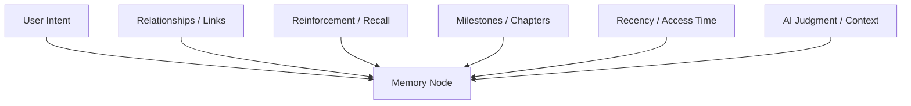

# Memory Importance Engine Specification

This document defines the architectural philosophy and conceptual design of the **Memory Importance Engine** within **AKIRA**. It describes how the companion evaluates, updates, and utilizes the long-term significance of memories to prioritize meaningful information while minimizing irrelevant recall and providing personal growth insights.

---

## 1. Purpose

An AI companion operating in a local, long-running context gathers vast amounts of information over time. Without a mechanism to distinguish crucial life goals from minor details, the system fails to prioritize meaningful information while minimizing irrelevant recall.

### Why Memory Importance Exists

Every day, a user generates hundreds of low-level signals (e.g., checking off a routine task, creating a temporary reminder note). If the system treats all events equally, it cannot prioritize critical milestones. The Memory Importance Engine provides a cognitive filtering layer, ensuring that core aspirations, deep preferences, and major life changes remain accessible, while trivial details transition to inactive or archived states.

### Difference from Recency and Favorites

- **Importance vs. Recency**: Recency is purely chronological. A task completed five minutes ago is highly recent, but it may be completely trivial (e.g., "Deleted a draft email"). A milestone achieved three months ago (e.g., "Obtained private pilot license") is older but remains infinitely more important to the user's life trajectory.
- **Importance vs. Favorites**: "Favorites" or "Pins" are explicit, manual user actions. A user should not have to manually curate every piece of information they want their companion to remember. Importance is an implicit, multi-layered quality estimated by the system to reduce the cognitive burden on the user.

---

## 2. Core Principles

The evaluation of memory significance is guided by four architectural pillars:

### Importance is Dynamic

Significance is not static, and it shifts with lifecycle changes. What is critical today (e.g., "Studying for tomorrow's compiler exam") will transition from active focus to a historical memory state once the exam is passed. Completed achievements remain highly valuable as historical memories rather than losing their overall importance.

### Importance is Explainable

AKIRA must never operate as a black box. If the system prioritizes a certain memory or recommends a specific task, the user must be able to inspect the underlying reasons. Every change in importance must be traceable to clear, human-understandable signals.

### Importance is Multi-Signaled

No single input determines significance. The engine synthesizes explicit user actions, implicit behavior patterns, structural relationships within the memory graph, and temporal factors to form a holistic view of importance.

### User Intent Always Has Priority

Explicit user commands always override system-generated estimations. If a user marks a memory as permanent, tags it as key, or tells the companion, "Forget this," the system immediately conforms, bypassing heuristic evaluations.

---

## 3. Importance Signals

The system evaluates memory importance by observing a variety of conceptual signals:

### User Intent

Direct declarations by the user, such as pinning an item, starring a project, or explicitly telling the companion, _"This is a key goal for me."_ This signal acts as a dominant override.

### Relationships

The degree of connection within the memory graph. A memory node linked to multiple active projects, core notes, and work sessions carries a higher significance than an isolated node with no relational links.

### Reinforcement

The frequency and repetition of a memory's usage. If a fact is recalled often during chat interactions or updated frequently across notes, its active significance is reinforced.

### Milestones

Whether an event represents a major transition point. Completing a project, achieving a streak milestone, or closing a long-standing story indicates high transitional significance.

### Recency

The time elapsed since the memory was created or last accessed. While not the sole indicator, recent items receive a temporary boost to ensure immediate context remains in focus.

### AI Judgment

A qualitative assessment made by the companion's core language model when parsing text (e.g., recognizing that a note contains a deep personal reflection or a critical professional pivot, rather than a grocery list).

---

## 4. Memory Categories

To manage persistence and consolidation, memories are classified into four lifecycle categories:

| Category      | Purpose                                                                                                                                                                                           | Example                                                                                             |
| :------------ | :------------------------------------------------------------------------------------------------------------------------------------------------------------------------------------------------ | :-------------------------------------------------------------------------------------------------- |
| **Permanent** | Crucial, static facts that define the user's core identity or explicit instructions. They do not decay and are always retained.                                                                   | User's name, long-term career aspirations, or explicit rules (e.g., _"I code only in TypeScript"_). |
| **Growing**   | Concepts that start small but accumulate importance as they collect relationships, repetitions, and sessions.                                                                                     | A new programming language study path that starts as a single note and expands into a project.      |
| **Dynamic**   | Memories that shift in significance based on active timelines. They are highly relevant during active phases and transition to a historical state upon completion, preserving their significance. | Active project tasks, immediate exam preparations, or temporary event schedules.                    |
| **Temporary** | Low-significance logs, routine tasks, or transient notes. They serve immediate context needs and are rapidly pruned or archived.                                                                  | Checked-off routine habits or single-sentence scratch notes.                                        |

---

## 5. Story Influence

In the AKIRA memory engine, the association of a memory with a **Story** (defined in [05-story-model.md](file:///C:/Users/lovsh/Desktop/Project%20Akira%20Master/AKIRA/docs/architecture/adaptive-memory-engine/05-story-model.md)) heavily influences its significance:

- **Narrative Anchor**: A memory linked to a Story inherits a baseline significance boost. The memory is viewed as part of a larger human journey, protecting it from standard decay.
- **Story Status Propagation**: If a Story is marked as `"Active"` or `"High Priority"`, all memories connected to it receive a corresponding elevation. When a Story is completed or archived, the connected memories retain their historical value but transition to a historical memory state, optimizing them for historical query matching rather than immediate task prioritization.
- **Cross-Story Intersection**: Memories that connect multiple Stories (e.g., a note on software performance that links both the _Building AKIRA_ and _RISC-V CPU_ stories) are recognized as high-level intersection nodes, representing cross-disciplinary user expertise or interests.

---

## 6. System Behavior

Estimated importance directly dictates how AKIRA acts, retrieves information, and interacts with the user:

### Memory Retrieval

When building prompt contexts, the retrieval engine queries the memory store. High-importance memories are retrieved first, ensuring that crucial user facts are always prioritized during context assembly.

### Context Building

For chat interactions, the system constructs a context profile. High-importance memories form the steady foundation of this context, while low-importance memories are only pulled if they share specific semantic similarity with the current conversation.

### Story Summaries

When generating long-term progress summaries, the engine uses importance thresholds to identify key milestones, filtering out minor daily task check-offs to present a clean narrative arc of the user's achievements.

### Recommendations

Daily mission proposals and project suggestion engines prioritize tasks and objectives that directly align with high-importance memories and active stories.

### Search Prioritization

When the user executes a search (e.g., via the global `Ctrl+K` command palette), results are sorted using a combination of text matching and memory importance, pushing critical project files and core thoughts to the top.

---

## 7. Design Philosophy

To build a trusted personal companion, the design of the Importance Engine adheres to three philosophical principles:

- **Transparency**: The user can view what the system considers important and why. There are no hidden parameters that the user cannot audit.
- **Control**: The user remains the ultimate authority. The system's estimation of importance is a helper utility; it must gracefully yield to user modifications and overrides.
- **Implementation Independence**: This specification defines the logical behavior of memory significance. Whether the underlying database is a local SQLite instance, a file-based JSON store, or a remote graph database, the relationship models and importance signals defined here remain constant.
