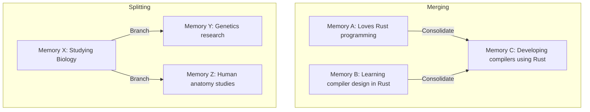

# Memory Lifecycle Specification

This document defines the complete lifecycle of a memory inside the **AKIRA** Adaptive Memory Engine. It outlines how memories are captured, validated, transitioned through active and historical phases, and archived, ensuring the companion behaves similarly to human memory.

---

## 1. Purpose

The lifecycle model defines the rules governing how cognitive data changes state inside AKIRA. Rather than treating memory as static database rows that are either kept indefinitely or deleted, AKIRA models memory as a dynamic flow.

This document answers the core lifecycle questions of the memory engine:

- **How does a memory come into existence?** Through the capture and extraction of raw physical workspace events and chat interactions.
- **How does it evolve?** By receiving reinforcement, accumulating links to other resources, or transforming through merging and splitting.
- **When does it become historical?** When the active projects, tasks, or milestones it supports are completed, shifting it from current execution focus to long-term experiential context.
- **When does it become archived?** When it falls out of relevance, has low reinforcement, or is manually retired by the user, while still remaining searchable.
- **Can memories merge?** Yes, when multiple redundant or overlapping observations are consolidated into a single fact.
- **Can memories split?** Yes, when a broad memory divides into distinct specialized areas as the user's activities branch.
- **Can stories influence lifecycle?** Yes, when a Story's status (Active, Completed, Archived) changes, it propagates transitions to its associated memories.
- **Can users manually promote or archive memories?** Yes, user commands are the absolute authority and override all automated state transitions.

---

## 2. Conceptual Lifecycle Stages

The lifecycle of a memory progresses through six distinct stages, from raw telemetry to long-term retention.

```
 [ Capture ]
      ↓
 [ Memory Candidate ]
      ↓
 [ Validated Memory ]
      ↓
 [ Active Memory ]
      ↓
 [ Historical Memory ]
      ↓
 [ Archived Memory ]
```

### 1. Capture

- **Purpose**: Ingestion of raw events.
- **Description**: Raw physical workspace events (e.g., checking off a task, saving a note, active chat inputs) are written to the immutable event log. At this stage, the data is unparsed telemetry.

### 2. Memory Candidate

- **Purpose**: Identification of potential significance.
- **Description**: The background consolidation engine analyzes raw events and flags recurring patterns, key statements, or important milestones as "candidates" for memory extraction. Candidates are not yet injected into the core system prompts.

### 3. Validated Memory

- **Purpose**: Verification and structural integrity.
- **Description**: The system verifies the candidate (automatically via AI semantic confidence checks or explicitly via user input). A validated memory receives its initial importance rating and is formally registered in the memory database.

### 4. Active Memory

- **Purpose**: Real-time context prioritization.
- **Description**: The memory is actively referenced by ongoing projects, daily missions, or current conversational threads. Active memories are heavily weighted during context assembly to guide the companion's daily focus and advice.

### 5. Historical Memory

- **Purpose**: Retaining completed achievements and experiences.
- **Description**: When the tasks or projects related to an active memory are completed, it transitions to a historical state. Historical memories do not actively influence daily missions, but they represent core user achievements and remain highly valuable for long-term narrative search, profile context, and progress summaries.

### 6. Archived Memory

- **Purpose**: Background retention for low-focus nodes.
- **Description**: Memories that have not been reinforced, accessed, or linked to active stories for an extended period transition to the archive. They are hidden from standard context feeds and dashboards but remain indexed and fully searchable.

---

## 3. Lifecycle Principles

The transition of memories through these stages is governed by six core principles:

### Memories Evolve Instead of Simply Growing Older

Chronological age does not dictate a memory's state. A fact captured two years ago (e.g., _"User is allergic to peanuts"_) remains in the Active state, while a reminder captured yesterday (e.g., _"Call courier service"_ ) can transition immediately to Historical or Archived once actioned.

### Historical Memories Remain Important

In traditional database design, completed items are often treated as garbage and purged. In AKIRA, completed achievements are preserved. A historical memory (e.g., _"Successfully launched V1.0 of the software"_) retains its high importance score even though its lifecycle state has shifted to Historical.

### Archived Memories Remain Searchable

Archiving is not deletion. If the user executes a search or asks, _"Did I work on a compilers project three years ago?"_, the system searches archived memories to retrieve the context, temporarily restoring them to active focus if queried.

### User Actions Override Automatic Transitions

The user holds ultimate control. If the system automatically archives a memory, the user can manually promote it back to Active. If the user tells AKIRA, _"Forget this detail,"_ the memory bypasses the archive and is immediately removed.

### Stories Direct Lifecycle Transitions

Stories (defined in [05-story-model.md](file:///C:/Users/lovsh/Desktop/Project%20Akira%20Master/AKIRA/docs/architecture/adaptive-memory-engine/05-story-model.md)) act as lifecycle anchors. When a Story's state changes (e.g., when a user finishes university, completing the _"University Life"_ story), the system cascades a transition trigger, moving all connected memories from Active to Historical.

### Importance and Lifecycle Are Independent Concepts

Importance measures _significance_, while Lifecycle measures _state_. A memory can be highly important and Historical (e.g., _"Won national hackathon"_), or low-importance and Active (e.g., _"Needs to buy groceries"_).

### Memory Reinforcement vs. Importance

Reinforcement represents how often a memory is naturally strengthened through continued interaction, usage, or related activity. It is distinct from Importance.

- **Examples of Reinforcement**:
  - Frequently revisiting a project.
  - Continuing a long-term goal.
  - Regularly referencing a preference.
  - Building upon previous learning.
- **Key Separation**: While reinforcement strengthens the connection of a memory and directly influences future recall probability, it does not automatically make a memory important. A highly reinforced memory can be of low importance (e.g., a repetitive workspace tab preference), and a critical high-importance memory might have very low reinforcement (e.g., a singular, pivotal life decision).

---

## 4. Evolution Mechanics

Memories are not static nodes; they merge, split, and adapt to the user's changing lifestyle.



### Memory Merging

As the user interacts with AKIRA, redundant or closely related memories will emerge. The consolidation engine merges these nodes. For example, if two memories exist:

1. _"User is studying RISC-V design"_
2. _"User is coding a CPU simulator"_
   They may be merged into a single consolidated memory: _"User is building a RISC-V CPU simulator"_, preserving the relational links of both original nodes.

### Memory Splitting

When a user's focus on a subject deepens, a broad memory may split into distinct specialized threads. For example, a general memory of _"User is studying aviation"_ might split into:

1. _"User is practicing instrument flight rules (IFR) maneuvers"_
2. _"User is preparing for FAA written exam"_

### Multi-Story Resolution

A single memory may belong to multiple Stories simultaneously. Therefore, lifecycle state transitions must consider the complete relationship graph rather than individual Story completions:

- **Graph Dependency Evaluation**: A transition triggers when a parent Story completes, but the memory must not transition to `Historical` or `Archived` if it is still actively linked to another active, uncompleted Story.
- **Example**: A memory connected to both _University Journey_ and _Building AKIRA_ must remain `Active` as long as _Building AKIRA_ is active, even if the _University Journey_ story is marked completed.
- **Resolution Rule**: State transitions evaluate all active reference pointers before updating a memory node's lifecycle state.

### Manual Promotion and Archival

The system provides explicit triggers for user curation:

- **Promote**: The user can manually pin a memory, elevating it to an Active state and overriding automatic decay.
- **Archive**: The user can flag a memory to be archived immediately, removing it from daily context while preserving it in historical search records.

---

## 5. Design Philosophy

AKIRA's memory engine behaves more like a human brain than a traditional file storage system:

- **No Arbitrary Deletion**: Humans do not wipe memories simply because they are old. We preserve them as experiences. AKIRA maintains this philosophy by shifting memories through lifecycle stages, ensuring that lessons learned in the past remain searchable for the future.
- **Meaningful Transition**: Transitions are driven by context. The shift from Active to Historical represents a shift in attention and cognitive focus, allowing the companion to align its suggestions with the user's current day-to-day focus while remaining aware of their past achievements.

---

## 6. Future Considerations

Future iterations of the Adaptive Memory Engine will explore several advanced capabilities:

- **Automatic Consolidation**: Background routines that run during periods of low activity to merge duplicate facts and reorganize memory clusters.
- **Story Formation**: Heuristics that identify when a cluster of related Active Memories has reached the threshold to automatically propose a new Story.
- **Memory Merging Loops**: Refined semantic algorithms to determine when merging is safe and when it would cause a loss of critical context.
- **AI-Assisted Promotion**: Proactive prompts where AKIRA asks, _"I noticed you have been focusing heavily on project design. Should we create a new active story for this?"_
- **Archive Optimization**: Smart indexing mechanisms that compress long-archived memories while keeping their semantic vector nodes queryable.
