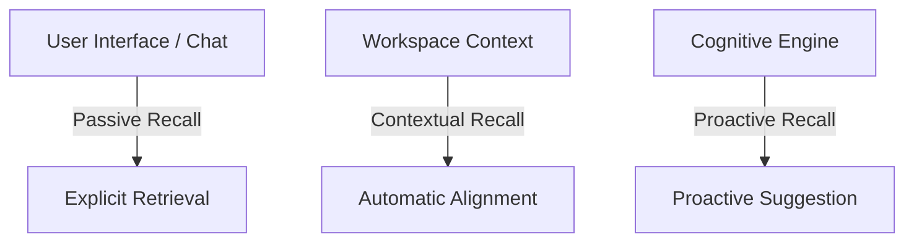

# Memory Retrieval and Recall Specification

This document defines the architectural specification of the **Retrieval and Recall Engine** within **AKIRA**. It describes the reasoning, philosophy, signals, and methods used by the companion to determine which memories should surface to active cognitive focus at any given moment.

---

## 1. Purpose

Having a rich network of events, memories, and stories is only useful if AKIRA can access the correct context when interacting with the user. The Retrieval and Recall Engine is responsible solely for selecting relevant memories based on active signals. Crucially, the Recall Engine does not communicate directly with AI models. Instead, it serves as a selector that provides candidate memories to the **Context Builder**, which is responsible for assembling the complete, final context package.

---

## 2. Core Questions

To understand how AKIRA retrieves context, we define the conceptual boundaries of recall:

### What is Recall?

Recall is the process of selecting relevant memories and transitioning them from inactive states (Historical, Archived, or Inactive Active) into candidates for context assembly. Recall does not directly feed reasoning models; it outputs candidate memories to the Context Builder.

### How is Recall different from Search?

- **Search** is a user-initiated query aimed at finding specific documents or keywords (e.g., searching the command palette for `"RISC-V"`). It is precise, deterministic, and document-centric.
- **Recall** is an associative, state-based activation. It runs continuously to retrieve contextually appropriate memories based on the user's current environment, project focus, and conversational cues, even if no explicit keyword matches.

### How is Recall different from Importance?

- **Importance** (defined in [04-memory-importance-engine.md](file:///C:/Users/lovsh/Desktop/Project%20Akira%20Master/AKIRA/docs/architecture/adaptive-memory-engine/04-memory-importance-engine.md)) measures the _inherent value_ of a memory node to the user's life trajectory.
- **Recall** is the _situational activation_ of a memory. A high-importance memory (e.g., _"Got married"_) is not recalled during a session where the user is debugging TypeScript errors. Conversely, a low-importance memory (e.g., _"User prefers dark-themed tabs in the browser"_) is recalled during a styling session.

### How does context influence Recall?

Context acts as the primary filter. The user's active application state, cursor position, active project, and recent chat inputs form a "retrieval field" that highlights semantically related memories in the database.

### How do Stories influence Recall?

Stories (defined in [05-story-model.md](file:///C:/Users/lovsh/Desktop/Project%20Akira%20Master/AKIRA/docs/architecture/adaptive-memory-engine/05-story-model.md)) act as narrative clusters. When a memory linked to a specific Story is recalled, it increases the recall probability of other memories connected to the same Story, enabling AKIRA to maintain narrative consistency.

### How does Reinforcement affect Recall?

Reinforcement (defined in [06-memory-lifecycle.md](file:///C:/Users/lovsh/Desktop/Project%20Akira%20Master/AKIRA/docs/architecture/adaptive-memory-engine/06-memory-lifecycle.md)) acts as an associative accelerator. Memories that are frequently updated, revisited, or reinforced have stronger cognitive pathways, making them easier to recall when relevant cues occur.

### Can the user manually trigger Recall?

Yes. The user can explicitly ask questions like, _"What were my goals for the compilers course?"_, which directly forces the retrieval engine to search and recall related memories.

### Should AKIRA proactively surface memories?

Yes, but selectively. To prevent cognitive fatigue, AKIRA should only proactively surface memories when there is a high-confidence correlation between a historical insight and the user's current actions (e.g., noticing the user is repeating a task they previously resolved).

---

## 3. Recall Signals

The engine synthesizes a variety of conceptual signals to determine recall priority:

- **Current Project**: The workspace project currently active in the user's dashboard.
- **Active Story**: The long-running narrative journey that the user is currently working through.
- **Recent Activity**: The sequence of events and check-ins recorded over the previous hours or days.
- **Related Memories**: The network of connections linking a recalled node to other nodes in the database.
- **Reinforcement**: The frequency of usage, protecting frequently used details from being forgotten.
- **Importance**: The static or dynamic significance rating of the memory node.
- **User Intent**: Explicit instructions from the user to prioritize or recall certain facts.
- **Time Relevance**: Periodic factors, such as seasonal goals, weekly routines, or morning/evening preferences.

---

## 4. Retrieval Philosophy

AKIRA retrieves memories based on **relevance to the current context** rather than basic keyword matching or raw chronological sequencing.

```
[ User Context Cues ] ──> [ Semantic Alignment Evaluation ] ──> [ Association Network Activation ] ──> [ Context Builder Candidates ]
```

Instead of simply querying a database for direct string matches (e.g., looking for the word _"TypeScript"_), the engine attempts to understand the user's current workspace domain. It prioritizes associations. For example, if the user is working on their flight simulator notes, the system naturally recalls aerodynamic principles and pilot goals, despite the lack of overlapping vocabulary in the immediate active note.

---

## 5. Recall Types

The system categorizes recall into three distinct conceptual types:



### Passive Recall

- **Purpose**: Resolves direct user requests.
- **Behavior**: Triggered when the user asks a question about their past or preferences. The system performs target retrieval on the memory ledger to answer the specific query.

### Contextual Recall

- **Purpose**: Maintains implicit alignment with the user's current work session.
- **Behavior**: Triggered automatically in the background as the user switches projects, edits notes, or writes code. Relevant memories are selected and sent as candidates to the Context Builder to guide ongoing feedback and assistance.

### Proactive Recall

- **Purpose**: Surfaces valuable insights before the user explicitly prompts the system.
- **Behavior**: Surfaces when the system detects a strong opportunity for reflection, correction, or planning (e.g., suggesting a task completed in a previous project phase that could solve a current bottleneck).

---

## 6. Design Philosophy

The design of the Retrieval and Recall Engine centers around one core cognitive goal:

> **Retrieval is the intelligence layer built on top of memory. The goal is not to remember everything; the goal is to remember the right thing at the right time.**

Remembering everything leads to information overload and decreases the quality of AI interactions. By filtering context through signals of Importance, Reinforcement, and Story relationships, AKIRA mirrors the selective forgetting and target recall of human cognition.

---

## 7. Future Considerations

As the memory engine transitions to an advanced agentic state, the following retrieval concepts will be explored:

- **Context Engine Integration**: Connecting to a system-wide context engine that feeds OS-level parameters (e.g., active IDE file, system focus mode) directly into recall signals.
- **Multi-Story Reasoning**: Enabling the companion to draw connections between two distinct stories to provide cross-domain insights (e.g., connecting patterns in the _Fitness Journey_ to focus levels in _Building AKIRA_).
- **Cross-Project Insights**: Synthesizing developmental milestones across separate, completed projects to suggest workflow optimizations.
- **Personalized Recall Behavior**: Dynamically tuning recall algorithms based on user feedback (e.g., learning whether the user prefers high levels of proactive recall suggestions or a quieter, more passive approach).
