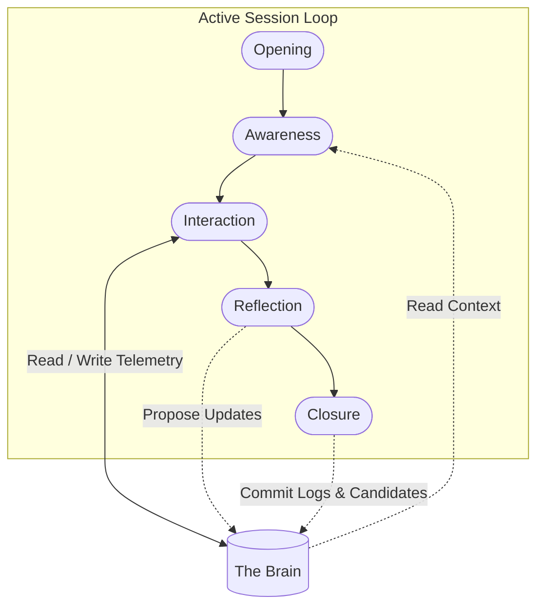

# Companion Session Lifecycle Specification

> [!IMPORTANT]
> **Companion Core**  
> **Version**: 1.0  
> **Status**: Proposed Specification  
> **Document**: 01-companion-lifecycle.md
>
> _This document serves as the foundational architectural specification for Companion Sessions within AKIRA, defining the session lifecycle independently of the underlying technological implementation._

---

## 1. Purpose

The **Companion Session** exists to bridge the gap between static, long-term intelligence and real-time human interaction. Rather than establishing a continuous, resource-heavy loop that runs indefinitely, AKIRA structures interactions into discrete, contextually rich events.

To understand the architecture, we must differentiate three core entities:

- **The Brain**: The persistent repository of long-term understanding. It houses historical event telemetry, consolidated semantic memories, identity models, narrative stories, and importances. It represents _who_ the user is and _what_ has occurred. The Brain is passive and persistent.
- **The Companion**: The active agentic system. It defines the character, behavioral protocols, communication constraints, and guidance principles (Celebrate, Encourage, Challenge, Reflect, Accountable) established in the [Companion Core Philosophy](file:///C:/Users/lovsh/Desktop/Project%20Akira%20Master/AKIRA/docs/architecture/companion-core/01-companion-philosophy.md). It represents _how_ AKIRA behaves.
- **The Session**: The temporary, bounded runtime interaction between the Brain and the Companion. It is the execution bridge where the Companion reads the Brain's current state to generate a localized, real-time experience for the user. It represents _when_ and _where_ active companionship occurs.

---

## 2. The Companion Session

A Companion Session is an ephemeral interaction space. It operates under strict structural boundaries:

- **Explicit Initiation**: A session begins when the user intentionally enters the AKIRA application environment (e.g., launching the client, focusing the workspace, or triggering a system interaction).
- **Natural Conclusion**: A session ends when the interaction naturally concludes (e.g., through user idle time, explicit sign-off) or when the application environment is closed.
- **Ephemeral Scope**: The session environment exists only during active engagement. It acts as volatile working memory that is allocated upon entry and completely dissolved upon exit.
- **No Memory Replacement**: A session does not write directly to or replace long-term memory systems in real time. Instead, it temporarily mirrors understanding and proposes updates that are evaluated upon closure.

---

## 3. Conceptual Lifecycle Stages

A Companion Session progresses through five distinct stages, ensuring that the experience is continuously aligned with the user's current situation.

### 1. Opening

- **Responsibility**: Session Initialization.
- **Description**: The system detects the user's presence, instantiates a unique session context, initializes temporary communication channels (audio, text, workspace telemetry listeners), and prepares to load context.

### 2. Awareness

- **Responsibility**: Context Ingestion & Alignment.
- **Description**: Before the user provides any input or a single message is exchanged, the temporary Awareness Session reads the state of the Brain to construct the initial `Awareness Snapshot`. Immediately after the Companion State Engine is initialized with this data, the Awareness Snapshot becomes immutable, and the Companion State Engine assumes sole ownership of the active working context. The Awareness Session does not manage the active interaction state.

### 3. Interaction

- **Responsibility**: Active Engagement & Guidance.
- **Description**: The active loop of communication. The user interacts through text, voice, or file modifications. The Companion processes these inputs through the lens of the situational model built during the Awareness stage, responding in accordance with the guidance principles.

### 4. Reflection

- **Responsibility**: Cognitive Synthesis.
- **Description**: As active input pauses, transitions, or the session approaches termination, the system reflects on the interaction. It analyzes the conversation flow and workspace changes to extract key themes, log completed tasks, evaluate progress against goals, and flag potential semantic memory candidates.

### 5. Closure

- **Responsibility**: Context Dissolution & Commit.
- **Description**: Ephemeral channels are wound down. The temporary session state is dissolved to ensure no local memory leakage. Structured outcomes (consolidated events, verified memory candidates, and updated task logs) are written back to the Brain's persistent layer.

---

## 4. Session Principles

The design of the Companion Session is governed by five architectural principles:

### I. Ephemerality of the Interface

Sessions are temporary. When a session terminates, the runtime is completely cleared. The Companion does not maintain running conversational states or active model context in memory between sessions.

### II. Grounded Generation

Companion experiences are generated dynamically from Brain understanding. The Companion does not store its own copy of the user's history; it pulls from the Brain’s structured layers to reconstruct context on demand.

### III. Single Source of Truth

The Brain remains the sole authority for persistent state. Any change in the user's goals, progress, or profile during a session must be written back to the Brain during the Reflection and Closure stages.

### IV. Start with Awareness

No session begins as a blank slate. The Companion must never greet the user with a generic, uncontextualized prompt. The Awareness stage ensures every session starts with an understanding of where the user is, what they were working on, and their outstanding goals.

### V. Separated Telemetry

The physical logs of what occurs during a session (keystrokes, files saved, raw chat transcription) are handled as telemetry events, decoupled from the higher-level semantic understanding stored in the Brain.

---

## 5. Relationship to the Brain

The Companion Session interacts with the different components of the Brain without owning or overriding them:

| Brain Component | Session Interaction Pattern                                                                                                           |
| :-------------- | :------------------------------------------------------------------------------------------------------------------------------------ |
| **Events**      | Ingests recent events during _Awareness_ to capture recent changes; appends new interaction events during _Closure_.                  |
| **Memories**    | Queries active semantic memories to ground conversation context; identifies and structures new memory candidates during _Reflection_. |
| **Stories**     | Tracks progress toward active stories (long-term narrative arcs); evaluates if a story milestone has been reached.                    |
| **Identity**    | Consumes user preferences, cognitive patterns, and communication limits to tailor the Companion's voice and challenges.               |
| **Importance**  | Uses importance thresholds to prioritize which recollections are injected into the active session context.                            |
| **Recall**      | Triggers associative recall loops when conversation topics cross-reference past workspaces or milestones.                             |
| **Context**     | Assembles these elements into the ephemeral session context block, which acts as the companion's short-term working memory.           |

---

## 6. Session Outcomes

The termination of a session does not guarantee changes to the user's permanent data. Depending on the nature of the interaction, a session may result in several outcomes:

- **New Event Telemetry**: A log of the session's duration, milestones hit, and files modified is added to the historical event stream.
- **Memory Candidates**: Synthesized facts or preferences observed during the session are queued for consolidation (e.g., _"User expressed frustration with current database architecture"_).
- **Story Updates**: Active narrative arcs are updated to show progress, or completed stories are marked as historical.
- **Identity Refinement**: Subtle adjustments to user habits, communication preferences, or focal values.
- **No Permanent Changes**: Brief or purely operational sessions (e.g., checking a task list status) dissolve without mutating any long-term memory or identity structures in the Brain.

---

## 7. Design Philosophy

The session lifecycle is designed around four core tenets:

- **Companionship instead of Conversation**: Modern chatbots focus entirely on text-generation loops. The AKIRA Companion Session focuses on side-by-side execution. A session may involve hours of silent workspace activity where the Companion merely monitors progress, stepping in only to challenge drifts or celebrate achievements.
- **Awareness instead of Reaction**: Rather than operating in a simple request-response format, the Companion uses its pre-session Awareness to offer proactive, contextual assistance tailored to the user's active state.
- **Continuity instead of Isolated Chats**: Because sessions build upon the persistent layers of the Brain, the transition between sessions feels like a continuation of a single, lifelong partnership rather than a series of fragmented chat logs.
- **Temporary Experiences Built Upon Persistent Understanding**: By separating the volatile runtime session from the persistent Brain, AKIRA maintains a lightweight interface while preserving a deep, cumulative model of the user's life and goals.

---

## 8. Future Compatibility

This lifecycle framework is designed to natively support future capabilities without requiring modifications to the lifecycle itself:

- **Voice**: Fits directly into the _Interaction_ stage as an alternative input/output modality, utilizing the same _Awareness_ context.
- **Vision**: Operates within the _Interaction_ stage, providing real-time visual telemetry (e.g., screen capture, camera focus) to update the session's situational model.
- **Calendar & Planning**: Fed directly into the _Awareness_ stage to establish temporal boundaries and goals for the session.
- **Daily Mission**: Provides the core target metrics during _Awareness_, tracking progress during _Interaction_, and validating completion during _Reflection_.
- **Automation**: Triggered during the _Interaction_ stage as background tasks, returning their execution logs to the session context.
- **Reflection Loops**: Run asynchronously following the _Closure_ stage to clean, merge, and optimize the memory candidates generated during the session.
