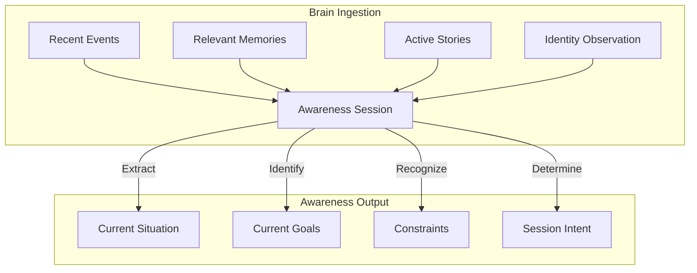

# Awareness Session Specification

> [!IMPORTANT]
> **Companion Core**  
> **Version**: 1.0  
> **Status**: Proposed Specification  
> **Document**: 02-awareness-session.md
>
> _This document defines the Awareness Session, the conceptual cognitive bridge between the persistent Brain and the active Companion interface in AKIRA._

---

## 1. Purpose

Before a companion can speak or assist responsibly, it must become aware. Traditional AI interfaces operate on a reactive model: they wait for user input, parse the request, and assemble context post-hoc to generate a response.

AKIRA rejects this reactive model in favor of a proactive **Awareness-First** architecture. The **Awareness Session** is the cognitive bridge that prepares the Companion before interaction begins.

```
┌───────────────┐        ┌───────────────────┐        ┌──────────────────┐
│   The Brain   │ ───►   │ Awareness Session │ ───►   │   Conversation   │
└───────────────┘        └───────────────────┘        └──────────────────┘
  Long-Term Fact           Temporary, Localized         Active Dialog Built
  & Story Storage            Context Assembly             Upon Loaded Context
```

- **The Brain**: Stores long-term, comprehensive understanding. It does not actively process conversation, serving instead as the passive reservoir of events, identity, and memories.
- **Awareness**: Gathers and structures only what is currently relevant to the user's immediate situation. It acts as the working memory for the upcoming interaction, answering the question: _"What does AKIRA understand about the user and their workspace right now?"_
- **Conversation**: The exchange of messages, voice, or collaborative planning. It does not search for basic context mid-sentence; rather, it is guided and constrained by the pre-assembled Awareness state.

---

## 2. The Awareness Session

An Awareness Session is a temporary initialization construct. It is characterized by the following boundaries:

- **Initialization Only**: The Awareness Session exists solely during Companion Session initialization. Its responsibility is limited to constructing the initial static `Awareness Snapshot`.
- **Immutable Snapshot**: Immediately after the Companion State Engine is initialized, the Awareness Snapshot becomes immutable and acts as a read-only historical baseline for the session.
- **Context Ownership Handover**: Upon initialization completion, the Companion State Engine becomes the sole owner of the active working context. The Awareness Session no longer owns or manages any active runtime interaction state.
- **Destructible**: The temporary structures created during initialization are destroyed when the session concludes, leaving only the immutable snapshot and persistent Brain records.

---

## 3. Awareness Responsibilities

The primary objective of the Awareness Session is to construct a clear conceptual model of the user's situation. It has the responsibility to discover and align:

- **The Current Situation**: The immediate physical state of the user’s workspace (e.g., active editor tabs, compile status, time of day).
- **Active Stories**: The broader narrative themes currently dictating the user's life (e.g., studying compiler design, training for a marathon).
- **Current Goals**: The milestones and objectives the user has defined for the day or week.
- **Unfinished Work**: Outstanding tasks, paused projects, or incomplete code units from previous sessions.
- **Recent Activity**: The sequence of events that occurred leading up to the session start.
- **Important User Preferences**: Behavioral boundaries (e.g., the user prefers direct feedback, avoids code suggestions in certain languages, or focuses on deep work in the evening).
- **Relevant Identity Observations**: Emergent observations about user patterns, focus cycles, or cognitive states.
- **Important Constraints**: Real-world limitations affecting the session (e.g., time limits, scheduled calendar events).



---

## 4. Session Intent

A critical responsibility of the Awareness Session is identifying the **Session Intent**. Session Intent is the Companion’s conceptual understanding of _why_ the user has initiated the session.

Unlike traditional platforms that force users into strict configurations (e.g., choosing "Coding Mode" or "Brainstorming Mode"), Session Intent is fluid. It is inferred during the Awareness stage and continuously refined during the Interaction stage.

Conceptual examples of Session Intent include:

- **Planning**: The user is organizing tasks, setting milestones, or structuring projects.
- **Learning**: The user is exploring a new concept, researching, or reviewing technical documentation.
- **Building**: The user is actively writing code, designing interfaces, or executing development tasks.
- **Reflection**: The user is reviewing their progress, analyzing setbacks, or summarizing achievements.
- **Casual Conversation**: The user is debriefing, checking in, or speaking conversationally without immediate execution goals.
- **Problem Solving**: The user is debugging, diagnosing a system bottleneck, or addressing a blocker.

Session Intent serves as a guide for the Companion's active persona, allowing the character to adjust its feedback (e.g., remaining silent during deep _Building_ sessions, or asking probing questions during _Reflection_).

---

## 5. Awareness Validation

Before the Companion is allowed to initiate conversation or respond to the user, the session must undergo **Awareness Validation**. The validation engine evaluates whether the pre-assembled context is sufficient to support a responsible, growth-oriented interaction.

If the validation engine detects that awareness is incomplete or contradictory:

- **Do Not Assume**: The Companion is prohibited from making guesses or fabricating assumptions about the user's current goals or workspace state.
- **Ask Clarifying Questions**: The session begins with a targeted inquiry (e.g., _"I see you modified the parser files while the application was closed, but your daily mission was to work on the code generator. Let's align on what we are focusing on today."_).
- **Maintain Truth Over Comfort**: The system must state what it does not know rather than pretending to understand.
- **Confidence Recovery**: Incomplete or incorrect initial assumptions do not permanently reduce the Companion's confidence. Once user clarification provides new evidence, Awareness Confidence recovers fully to align with the confirmed truth.

Awareness Validation is designed to **increase trust rather than intelligence**. It ensures that AKIRA acts as an honest partner who values accuracy over superficial conversational flow.

---

## 6. Awareness Snapshot

At the end of the initialization phase, the session generates an **Awareness Snapshot**. This snapshot is the structured working model used by the Companion during the active interaction loop. The snapshot is temporary, read-only, and discarded upon session closure.

An Awareness Snapshot conceptually contains:

```
┌────────────────────────────────────────────────────────┐
│                   AWARENESS SNAPSHOT                   │
├────────────────────────────────────────────────────────┤
│ • Session Identifier : Unique runtime UUID             │
│ • Temporal Reference : Initiation index from temporal  │
│                        reference                       │
│ • Session Intent     : Inferred primary focus          │
│ • Active Stories     : Links to long-term narratives   │
│ • Active Goals       : Target milestones for the day   │
│ • Relevant Memories   : Retrieved semantic facts        │
│ • Identity Observations: Active behavioral guidelines   │
│ • Current Constraints : Time limits, workspace locks    │
│ • Recent Activity    : Log of immediate prior events   │
└────────────────────────────────────────────────────────┘
```

---

## 7. Relationship with the Brain

The Awareness Session acts as a strict consumer of the Brain's data:

- **Read-Only Consumptive Interface**: Awareness retrieves structured outputs generated by the Event Log, Memory database, Story models, Identity Layer, Importance Engine, Recall mechanisms, and the Context Builder.
- **Zero Mutation**: The Awareness Session cannot modify, delete, or append records within the Brain. It acts as an isolated sandbox.
- **Authoritative Source**: The Brain remains the sole source of truth. If a discrepancy exists between the session's temporary model and the Brain's persistent layers, the Brain's records dictate the state.

---

## 8. Relationship with Conversation

Conversation does not occur in a vacuum; it is anchored to the Awareness Snapshot.

- **Non-Empty Initialization**: When the user opens the chat, the interface is primed. The Companion's opening greeting or active feedback is shaped by the loaded snapshot.
- **Continuous Refinement**: The conversation is the active tool for updating working context. Once the initialization transitions ownership to the Companion State Engine, the active state is updated during conversation. The initial Awareness Snapshot remains immutable, providing a fixed baseline for the session.
- **Dynamic Evolution**: As the conversation uncovers new insights, the active working context in the Companion State Engine adapts in real time, ensuring that the Companion's advice remains relevant throughout the entire interaction.

---

## 9. Relationship with Reflection

When the Companion Session winds down, the final state of the Awareness Snapshot is handed over to the Reflection stage.

- **Outcomes Mapping**: The Reflection engine compares the initial Awareness Snapshot (what was expected or understood at the start) with the final telemetry of the session (what actually occurred).
- **Continuous Improvement**: By analyzing this delta, the Reflection stage accurately determines:
  - Which event logs need to be committed.
  - Which memory candidates should be extracted.
  - Whether stories should be updated or completed.
  - If identity observations require adjustment.
- **Historical Continuity**: This handoff ensures that the learnings of the current session are securely written to the Brain, directly informing the Awareness stage of the next session.

---

## 10. Design Philosophy

The Awareness architecture is governed by five core philosophical guidelines:

- **Presence Before Conversation**: We value knowing where the user is over knowing what to say. AKIRA's first duty is to understand the context of the user's work environment.
- **Understanding Before Response**: Silence or clarifying questions are preferred over generic, incorrect answers.
- **Questions Before Assumptions**: If the system is uncertain about workspace intent or user goals, it must ask rather than guess.
- **Confidence Proportional to Evidence**: The Companion's suggestions must mirror the certainty of the data in the snapshot. Low evidence must result in tentative, humble framing.
- **Guidance over Reasoning**: Awareness structures the conversation, but does not dictate the user's logic or choices. The user retains absolute autonomy.

---

## 11. Future Compatibility

The Awareness Session is built to adapt to future input channels without modifications to its core architectural structure:

- **Voice Interactions**: The Awareness Snapshot grounds voice conversations in the same contextual parameters as text, preventing the companion from sounding generic during spoken exchanges.
- **Vision**: When vision processing is introduced, its outputs (e.g., active workspace UI states, handwritten notes) are loaded into the _Recent Activity_ and _Current Situation_ fields of the snapshot.
- **Calendar Awareness**: Scheduled calendar items are ingested as _Current Constraints_, allowing the companion to manage time limits and focus blocks.
- **Desktop Activity**: OS-level active application logs are processed into the _Recent Activity_ stream during initialization.
- **Daily Mission**: The status of daily objectives is loaded as _Active Goals_ and dynamically verified.
- **Automation**: Background agents use the Awareness Snapshot to check constraints and user preferences before executing scheduled or triggered tasks.
