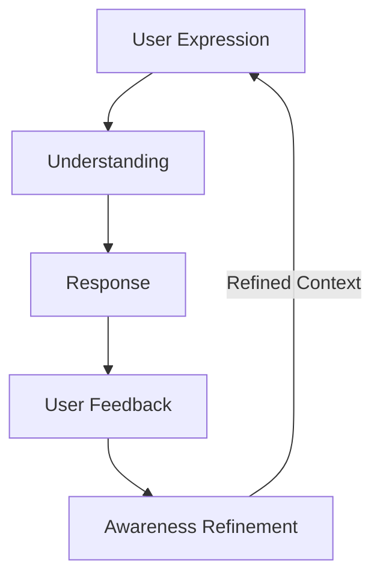

# Conversation Lifecycle Specification

> [!IMPORTANT]
> **Companion Core**  
> **Version**: 1.0  
> **Status**: Proposed Specification  
> **Document**: 05-conversation-lifecycle.md
>
> _This document defines the complete conceptual lifecycle of a conversation inside an active Companion Session, outlining how exchanges unfold from initiation to reflection independently of technical execution._

---

## 1. Purpose

Within the AKIRA architecture, a conversation is not an isolated chat log. It is the active, real-time expression of a broader [Companion Session](file:///C:/Users/lovsh/Desktop/Project%20Akira%20Master/AKIRA/docs/architecture/companion-core/01-companion-lifecycle.md).

The interaction follows a structured sequence:

```
┌────────────────────────────────────────────────────────┐
│                   COMPANION SESSION                    │
│      (The overall runtime container of user focus)     │
└───────────────────────────┬────────────────────────────┘
                            │
                            ▼
┌────────────────────────────────────────────────────────┐
│                   AWARENESS SESSION                    │
│      (Pre-interaction context assembly from Brain)     │
└───────────────────────────┬────────────────────────────┘
                            │
                            ▼
┌────────────────────────────────────────────────────────┐
│                      CONVERSATION                      │
│      (The active verbal, text, or action exchange)     │
└───────────────────────────┬────────────────────────────┘
                            │
                            ▼
┌────────────────────────────────────────────────────────┐
│                       REFLECTION                       │
│    (Post-interaction consolidation and data commit)    │
└────────────────────────────────────────────────────────┘
```

The Conversation serves as the primary gateway for collaborative execution, allowing the Companion to challenge, celebrate, support, and guide the user through real-time communication.

---

## 2. Conversation Initiation

A conversation never starts from an empty or generic state.

- **Awareness Ingestion**: Before the first message is typed or spoken, the conversation is initialized using the pre-assembled [Awareness Snapshot](file:///C:/Users/lovsh/Desktop/Project%20Akira%20Master/AKIRA/docs/architecture/companion-core/02-awareness-session.md#6-awareness-snapshot).
- **Contextual Presence**: The Companion greets the user or opens the session with direct, immediate alignment with their current work context (e.g., _"I see we have the parser test failing. Let's finish the grammar specification today."_).
- **No Reactive Questioning**: The Companion does not ask generic introductory questions (e.g., _"How can I help you today?"_ or _"What are we working on?"_), as it is already aware of the workspace status.

---

## 3. Conversation Cycle

Once initiated, the conversation operates in a continuous, refining loop:



- **User Expression**: The user provides input via text, voice, or workspace action.
- **Understanding**: The Companion processes the input against the active Awareness Snapshot, identifying goals, obstacles, or statements of intent.
- **Response**: The Companion generates a message grounded in its [Companion Presence](file:///C:/Users/lovsh/Desktop/Project%20Akira%20Master/AKIRA/docs/architecture/companion-core/04-companion-presence.md) rules.
- **User Feedback**: The user reacts to the suggestion, correcting, validating, or building upon it.
- **Awareness Refinement**: The system updates the session's active snapshot to reflect new goals, revised tasks, or corrected assumptions, directly informing the next iteration of the loop.

This cycle refines the active session context in real time without mutating long-term database values prematurely.

---

## 4. Understanding Before Response

Before formulating a response, the Companion is conceptually obligated to evaluate the input to ensure quality:

- **Intent Analysis**: Determining what the user is trying to accomplish (e.g., debugging, brainstorming, planning).
- **Ambiguity Detection**: Identifying statements that lack clarity (e.g., _"Let's build that module"_ when multiple modules exist).
- **Missing Information Verification**: Flagging missing parameters necessary to provide support.
- **Awareness Check**: Ensuring the user's input does not conflict with active constraints, goals, or historical preferences.
- **Uncertainty Evaluation**: Determining the Companion's confidence in its understanding.

If confidence is low or ambiguity is high, the Companion must **prioritize clarification over assumptions**. Asking a targeted question is always preferred over generating speculative advice.

---

## 5. Response Philosophy

Every conversational response must align with the behavioral constitutional pillars:

- **Helpful**: Centered on user execution and growth.
- **Honest**: Communicating difficulties and boundaries without sycophancy.
- **Context-Aware**: Sized and formatted to match the user's situation (e.g., concise code reviews during intense work blocks; descriptive explanations during learning sessions).
- **Concise**: Avoiding unnecessary verbosity, filler text, or preambles.
- **Consistent with Presence**: Written in a natural, calm, direct, and warm tone.

Quality is evaluated strictly by the value of the guidance, never by the volume of output.

---

## 6. Conversation Evolution

Conversations are dynamic narratives. As the session progresses:

- **Goals Clarification**: Initial broad statements (e.g., _"I want to write a compiler"_) evolve into specific goals (e.g., _"I need to resolve a shift-reduce conflict in the grammar parser"_).
- **Awareness Updates**: The snapshot updates to reflect shifts in focus.
- **Assumption Correction**: If the user corrects a Companion's observation (e.g., _"No, I'm testing the compiler locally first, not deploying it"_), the situational snapshot updates instantly.

The Companion adapts to these changes immediately, remaining grounded in the current reality of the interaction.

---

## 7. Reflection Trigger

A conversation does not abruptly end and delete its context. As dialogue pauses or concludes:

- **Asynchronous Reflection**: The system initiates reflection in the background, preventing interruption of the user's stream of thought.
- **Outcome Evaluation**: The system evaluates the exchange for:
  - **Telemetry Events**: Workspace changes or completed missions.
  - **Memory Candidates**: Important facts, preferences, or decisions that meet the [Memory Worthiness](file:///C:/Users/lovsh/Desktop/Project%20Akira%20Master/AKIRA/docs/architecture/companion-core/03-memory-policy.md#2-memory-worthiness) guidelines.
  - **Story Updates**: Progress towards active stories.
  - **Identity Refinements**: Nuances discovered about user behavior or patterns.

---

## 8. Conversation Completion

Conversations conclude naturally based on user presence and intent:

- **Continuance**: The user transitions to workspace execution; the conversation remains active but silent.
- **Pause**: The user steps away; the session pauses.
- **Closure**: The application closes or the user explicitly signs off.

If a conversation is left unfinished, the details are committed to the Brain's long-term memory systems. In the next session, the Awareness stage reads this state and reconstructs the narrative thread, allowing the interaction to resume seamlessly **without needing to reload or preserve volatile chat logs**.

**Graceful Abandonment**: Unfinished sessions or suspended conversations are not treated as failures. Human interruptions are expected and normal. The Companion must never guilt, prompt, or pressure the user to resume unfinished tasks or conversations from previous sessions.

---

## 9. Conversation Principles

The conversation model is defined by six architectural rules:

- **Understanding Before Response**: Prioritize semantic clarity over immediate speed.
- **Questions Before Assumptions**: Clarify ambiguity directly instead of guessing.
- **Awareness Before Reaction**: Frame every turn using the active situational snapshot.
- **Reflection After Interaction**: Consolidate context asynchronously once communication pauses.
- **Continuity Without Dependency**: Encourage user action and autonomy, avoiding chat loops that create dependency.
- **Guidance Without Control**: Offer structured partnership, but leave all final choices to the user.

---

## 10. Future Compatibility

This lifecycle scales to support all future interaction modalities without changing the structural stages:

- **Voice**: Adapts the Conversation Cycle to real-time audio streams, processing voice inputs as User Expressions and handling response output via speech synthesis, grounded in the same Awareness Snapshot.
- **Vision**: Enhances the Understanding phase by integrating screen captures or workspace elements as part of the User Expression input.
- **Calendar Planning**: Feeds schedule limits directly into the Initiation stage, enabling the Companion to guide the conversation based on time limits.
- **Daily Mission**: Serves as the active framework for the Conversation Cycle, keeping dialogue focused on achieving daily goals.
- **Coding Assistance**: Anchors technical reviews and parser support in the ongoing Conversation Cycle, ensuring code suggestions are contextually filtered through the loaded snapshot.
