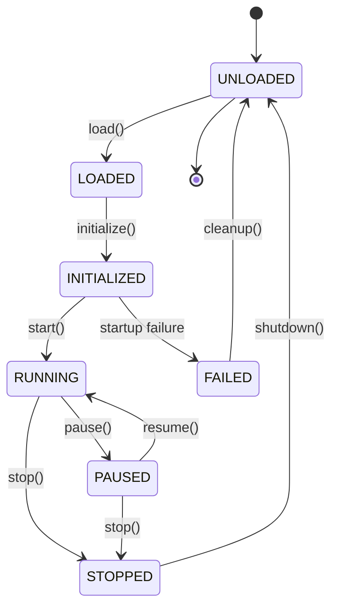
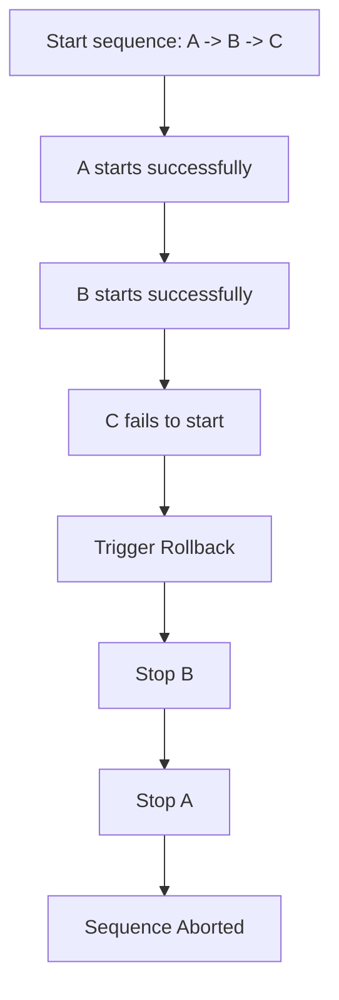

# Module Lifecycle Manager

This document outlines the state transition logic, hook sequences, timeouts, and rollback protocols enforced by the **Lifecycle Manager** in **AKIRA OS**.

---

## State Transition Diagram

Every module in the platform is managed through a strict, deterministic finite state machine (FSM).

---

## Transition Table

| Current State | Target State | Trigger Method | Action / Hook Executed |
| :--- | :--- | :--- | :--- |
| **UNLOADED** | **LOADED** | `load()` | Registers module metadata; emits `loaded` event |
| **LOADED** | **INITIALIZED**| `initialize()` | Runs `onInitialize` hooks |
| **INITIALIZED**| **RUNNING** | `start()` | Runs `onStart` hooks & `startup()` |
| **INITIALIZED**| **FAILED** | *Failure* | Emits `failed` event; cleanup to UNLOADED |
| **RUNNING** | **PAUSED** | `pause()` | Runs `onPause` hooks & `pause()` |
| **PAUSED** | **RUNNING** | `resume()` | Runs `onResume` hooks & `resume()` |
| **RUNNING** | **STOPPED** | `stop()` | Runs `onStop` hooks & `shutdown()` |
| **PAUSED** | **STOPPED** | `stop()` | Runs `onStop` hooks & `shutdown()` |
| **STOPPED** | **UNLOADED** | `stop()` / `unload()`| Runs `onShutdown` hooks |
| **FAILED** | **UNLOADED** | *Cleanup* | Transitions to UNLOADED |

---

## Hook Execution Sequence

When state transitions occur, hooks are executed in a deterministic sequence:
1. **Global Observers**: Custom hooks registered globally with `LifecycleManager` execute first. Failure inside an observer hook is caught and isolated to prevent blocking the transition itself.
2. **Module Callbacks**: The module's own definition callbacks (e.g. `startup`, `shutdown`) are executed. Failure here transitions the module to `FAILED` and aborts the transition.

---

## Rollback Behavior

If the startup sequence of multiple modules fails midway:
1. The resolver/manager aborts the sequence.
2. **Rollback** is executed: any module successfully started *during this specific boot sequence* is stopped and unloaded in reverse order of its startup.
3. Modules that were already running before the sequence started remain untouched.

---

## Restart Sequence

A restart represents a full cycle resetting the runtime instance of a module:
$$\text{Restart} = \text{Stop} \rightarrow \text{Unload} \rightarrow \text{Load} \rightarrow \text{Initialize} \rightarrow \text{Run}$$

---

## Failure Isolation Policies

AKIRA OS supports pluggable failure policies:
* **StrictPolicy**: Any startup hook failure aborts the boot process and triggers a rollback of the boot sequence immediately.
* **FailFastPolicy**: Aborts the boot process immediately without continuing.
* **ContinueOnFailurePolicy** (Default):
  - Records the failure and publishes diagnostic details.
  - Recursively identifies and prunes all dependent modules in the remaining startup queue.
  - Continues booting independent modules.

---

## Timeout Handling

Configurable timeouts can be specified in the module manifest (`startupTimeout` / `shutdownTimeout`). 
* If a hook execution exceeds the timeout limit, the resolver interrupts the task, transitions the module to `FAILED`, publishes a timeout diagnostic event, and continues the boot sequence to avoid blocking the runtime.
