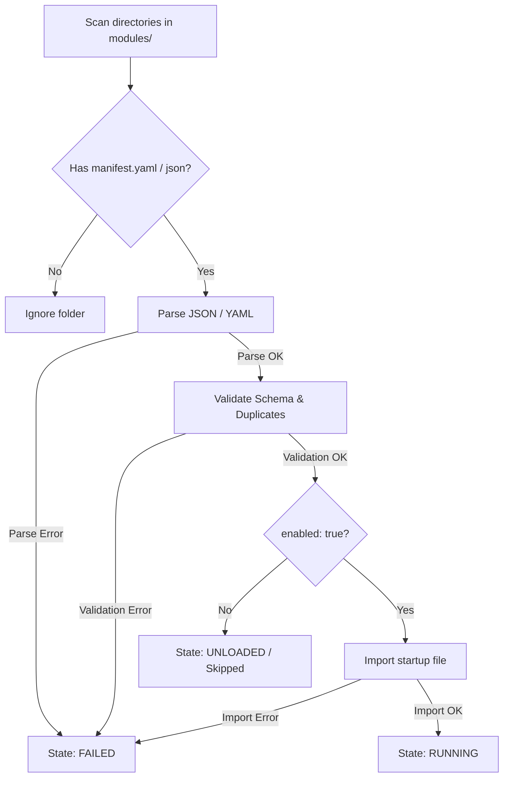

# Module Manifest System

This document outlines the manifest format, validation procedures, discovery scanning, and best practices for writing module manifests in **AKIRA OS**.

---

## Purpose

The Module Manifest System establishes a formal contract between functional modules and the platform core. Instead of inspecting or compiling module source code to discover features, the platform runtime reads and validates a manifest file (`manifest.yaml` or `manifest.json`) stored inside the module's root folder.

This design enables:
* **Centralized Metadata**: Modules publish description, author, versions, and repository details upfront.
* **Pre-Load Checks**: The runtime validates version bounds, duplicates, and constraints prior to importing any source code, preventing memory pollution.
* **Sandboxed Declarations**: Permissions, capability claims, and custom routes are explicitly declared and registered.

---

## Discovery Process

During platform boot, `RuntimeManager` executes automatic filesystem discovery:

1. Scans the configured `modules/` directory for subfolders.
2. Checks if each subfolder contains a manifest file (`manifest.yaml`, `manifest.yml`, or `manifest.json`).
3. Reads and parses the manifest (with a zero-dependency YAML and native JSON parser).
4. If parsing fails, the module is registered as `FAILED` with diagnostics recorded.
5. If the manifest specifies `enabled: false`, the module is registered as `UNLOADED` but execution is skipped.
6. If the manifest is valid, the runtime imports the designated `startup` entry file.



---

## Validation Rules

Manifests are subjected to strict validation rules before execution:

* **Required Metadata**: `id`, `name`, `version`, `sdkVersion`, `description`, and `author` must be present and non-empty.
* **SemVer Formatting**: 
  - `version` must match strict Semantic Versioning (`major.minor.patch`).
  - `sdkVersion` must match a valid SemVer Range (allowing prefix symbols like `^`, `~`, `>=`, `<=`, and partial versions like `^1.7`).
* **Conflict Prevention (Duplicate Check)**:
  - `id` must be unique across the platform runtime registry.
  - Declared `routes` must not overlap with routes mapped by other active modules.
  - Declared `capabilities` must be unique to prevent service collision.
* **Strict Schema**: No unknown keys are permitted (preventing typos and deprecated properties).
* **Event Structure**: `events.publishes` and `events.subscribes` must be flat arrays of non-empty strings.

---

## Example Manifest (`manifest.yaml`)

```yaml
id: calendar
name: Calendar Scheduler
version: 1.2.0
sdkVersion: ^1.7
description: Standard calendar appointment management module.
author: AKIRA OS Team
homepage: https://akira-os.org/calendar
repository: https://github.com/akira-os/calendar-mod
license: MIT
permissions:
  - notifications
  - storage
dependencies:
  - timeline
capabilities:
  - scheduling
routes:
  - /calendar
events:
  publishes:
    - appointment.created
    - appointment.cancelled
  subscribes:
    - timeline.event.added
startup: index.js
enabled: true
```

---

## Best Practices

1. **Keep IDs Lowercase**: Use kebab-case for module IDs (e.g. `todo-manager`, `analytics-dashboard`) to ensure consistent path matching.
2. **Path Convention for Routes**: All routes must start with a leading slash `/` (e.g. `/calendar`).
3. **Minimize Permissions**: Only request permissions that are absolutely essential for the module's declared features.
4. **Clean File Outputs**: Point the `startup` field directly to your compiled ESM bundle entry point (e.g. `dist/index.js` or `index.js`).
