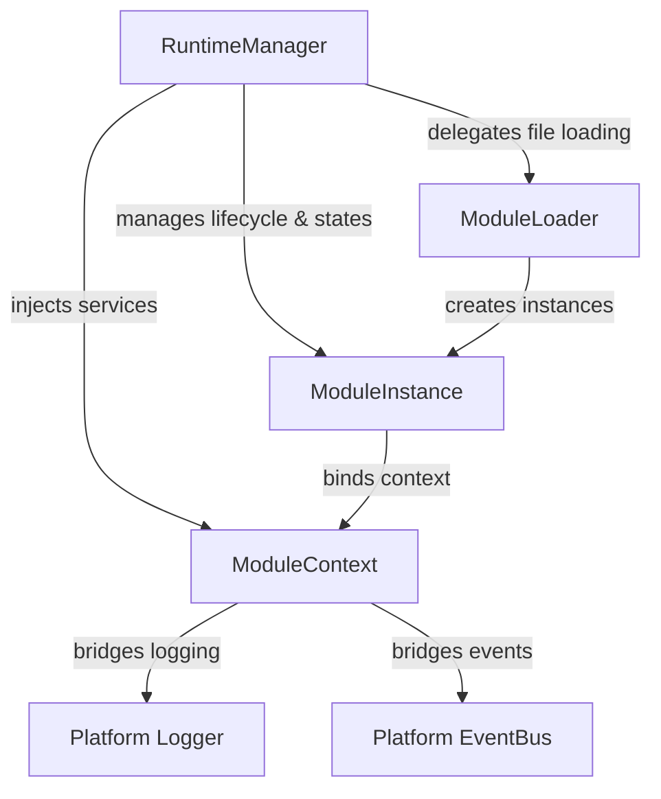
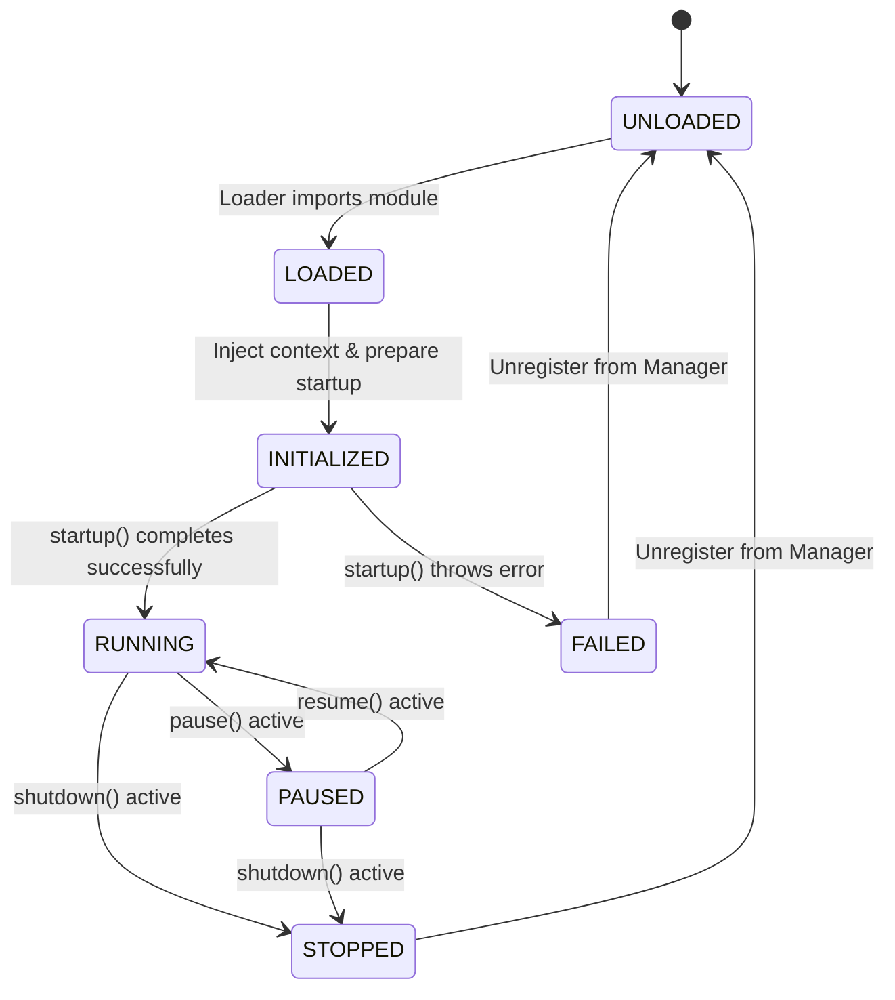

# Module Runtime Core

This document outlines the architecture, lifecycle rules, design patterns, and roadmap for the platform module runtime in **AKIRA OS**.

---

## Purpose

The Platform Runtime transforms AKIRA OS from a static application framework into an extensible operating platform. It enables the system to dynamically discover, load, validate, instantiate, manage, and shut down isolated functional modules. 

Instead of treating modules simply as source folders or static imports, the Platform Runtime tracks them as managed runtime entities, providing a uniform boundary for execution, isolation, logging, configuration injection, and inter-module event communication.

---

## Architecture Topology

The runtime follows a decoupled, interface-driven design. The orchestrator, loader, instances, and contexts are decoupled using clean contracts:

### Components

1. **`RuntimeManager`**: The orchestrator. Manages initialization, folder-based/explicit discovery, registrations, lookup APIs, manual operations, and graceful shutdowns.
2. **`ModuleLoader`**: The loader. Performs dynamic ES imports, validates entry-point exports (names and versions), and instantiates module runtime wrapper objects.
3. **`ModuleInstance`**: The lifecycle container. Handles state transitions and delegates command hooks (`startup`, `pause`, `resume`, `shutdown`) to user-defined modules.
4. **`ModuleContext`**: The SDK environment. Injects services (logger, eventBus, config, runtime manager) into loaded modules, isolating them from global platform mutability.
5. **`ModuleState`**: A strongly typed state machine representing the lifecycle stages of any loaded module.

---

## Lifecycle Rules

Every module adheres to a deterministic state machine. Undefined or invalid transitions will throw errors, preventing inconsistent states.

### State Transitions

### Transition Matrix

| From State | Allowed To States | Description |
| :--- | :--- | :--- |
| **UNLOADED** | `LOADED` | Module successfully imported from path. |
| **LOADED** | `INITIALIZED` | Injecting context and preparing startup. |
| **INITIALIZED** | `RUNNING`, `FAILED` | Successful startup moves to `RUNNING`. Any error drops to `FAILED`. |
| **RUNNING** | `PAUSED`, `STOPPED` | Can be paused for backgrounding, or stopped. |
| **PAUSED** | `RUNNING`, `STOPPED` | Resumed back to active execution, or stopped directly. |
| **STOPPED** | `UNLOADED` | Final cleanup; unregisters from manager. |
| **FAILED** | `UNLOADED` | Failsafe cleanup for faulted modules. |

---

## Error Handling & Isolation

The Platform Runtime guarantees that **individual module failures never compromise system stability**:
* If a module fails during startup, it transitions to `FAILED` and then `UNLOADED` immediately. Diagnostic logs are published, but other modules continue to boot normally.
* If a module hook (e.g. `shutdown`, `pause`) throws an exception, it is logged safely, and cleanup transitions complete to avoid dangling states.
* Modules do not communicate directly. They interact asynchronously using the `eventBus` inside their `ModuleContext`.

---

## Future Roadmap

1. **Sprint 1.2 — Manifest System**: Define module manifests (`manifest.json`) verifying compatibility, metadata, author data, and licensing.
2. **Sprint 1.3 — Capability Registry & Permission Framework**: Declare capability requirements and restrict module resource access based on user-approved permissions.
3. **Sprint 1.4 — Dependency Resolver**: Automatically resolve, load, and order modules based on dynamic dependency topological sorts.
4. **Sprint 1.5 — Platform SDK**: Introduce high-level SDK libraries for modules to hook into the UI, settings database, and workspace search systems.
