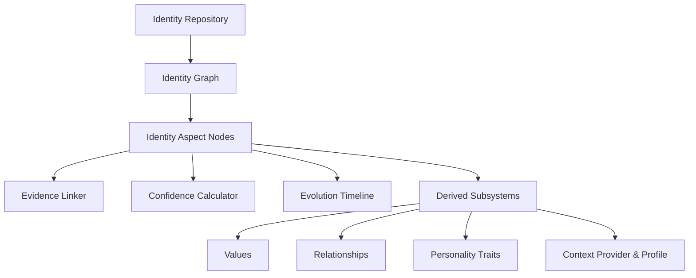

# GENESIS Identity Subsystem (v2.19)

The Identity module represents the user's current cognitive state, derived attributes, confidence metrics, and historical evolution timeline in a structured, deterministic, and explainable manner.

## Architecture & Subsystems

### 1. Identity Graph
Aspects are modeled as nodes of type `IdentityNode` with specific types (`Trait`, `Value`, `Preference`, `Habit`, `Skill`, `Interest`, `Goal`, `Personality`, `Relationship`, `Other`) and connected by semantic edges (`IdentityEdge`).

### 2. Evidence Engine
Every graph node maintains references to supporting cognitive events, memories, or notes via `IdentityEvidence` to remain fully traceable.

### 3. Confidence Engine
Evaluates structural confidence (0.0 to 1.0) based on factors like evidence weights, recency, contradiction count, and explicit user confirmations.

### 4. Evolution Engine
Compiles append-only state snapshots to track timeline version increments on any structural identity modifications.

### 5. Derived Subsystems
- **Value Engine**: Derives values from interests, goals, skills, and evidence.
- **Relationship Engine**: Models target connections and strength from evidence.
- **Personality Engine**: Determines traits deterministically from values, habits, and evidence.

---

## Public APIs

The main entrypoint is `identityService` (`identityFoundationService`), exposing:

### Profile & Context
- `getIdentityProfile(id)`: Returns the current aggregated `IdentityProfile`.
- `getIdentitySummary(id)`: Returns a deterministic summary DTO.
- `getIdentityHealth(id)`: Evaluates structure (Healthy, Sparse, Conflicted, Partial).
- `getIdentityCompleteness(id)`: Computes percentage completeness.

### Aspect Management
- CRUD APIs for **Interests, Skills, Goals, Habits, Preferences, Values, Relationships, and Personality traits**.

### Validation
- `validateIdentity(id)`: Runs graph, evidence, and timeline consistency sweeps.

---

## Event Flow
Subsystem lifecycles dispatch event types matching:
- `identity.goal.*`
- `identity.habit.*`
- `identity.preference.*`
- `identity.value.*`
- `identity.relationship.*`
- `identity.personality.*`
